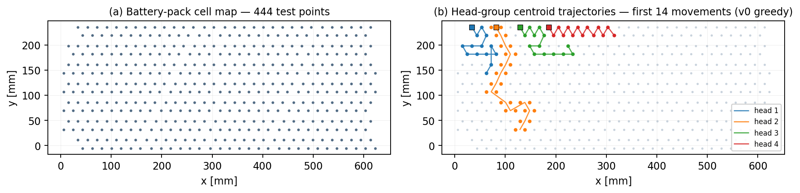
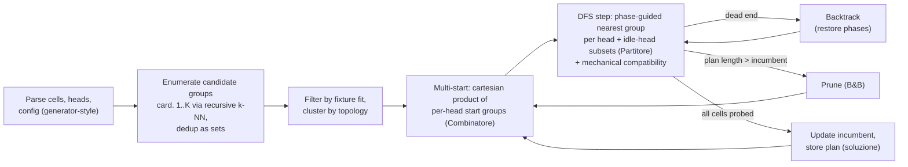

# Pylot-BT — Multi-Head Motion Planning for an Industrial EV-Battery Flying Prober

**R&D internship project @ [Seica S.p.A.](https://www.seica.com/) (Strambino, Italy) · Oct–Dec 2019**

-blue)  

A from-scratch **combinatorial motion planner** for a four-head flying-probe battery tester: given the map of an EV battery pack, it computes a collision-free sequence of simultaneous head placements that probes **every cell** while minimizing head travel. The target machine — four independent XYZ heads, each carrying a mini-fixture that contacts up to four cells per placement — corresponds to what Seica later commercialized as the **Pilot BT** flying prober for EV battery test (NEXT> series, publicly launched in 2020). This repository is the planning-core prototype I built during the internship: **~2.6k lines of pure C, zero external dependencies, every data structure and algorithm hand-written**.

<p align="center">
  
  <br/>
  <em>(a) the real input dataset: 444 test points of a battery pack (623 × 241 mm) · (b) planned centroid trajectories of the four heads over the first 14 movements (baseline planner)</em>
</p>

---

## The problem

**Input.** A set *C* of cells (test points) with planar coordinates (`Dati/DatiCelle.txt`, 444 points in the committed dataset); *H* = 4 test heads, each with a rectangular footprint, mechanical tolerances and a fixture offset (`Dati/DatiTeste.txt`); a per-head capacity *K* = 4 cells per placement (`Dati/Configurazioni.txt`).

**Output.** An ordered sequence of *movements*. In each movement every head is assigned a *group* of at most *K* cells (or stays idle) and probes it in a single touch-down.

**Constraints.**
1. **Coverage** — every cell is probed at least once by the end of the plan.
2. **Fixture fit** — a group is assignable only if its bounding box fits under the head's probe field (`gruppoCompatibile`).
3. **No collision / no crossing** — within a movement, heads keep their left-to-right order and their occupied-surface x-intervals must not overlap, tolerances included (`checkCompatibilitaTeste`).
4. **Topology compatibility** — successive groups assigned to a head are drawn from the same *topology class* (identical relative cell geometry), because the fixture contact pattern is fixed (`raggruppaPerTopologia`).
5. **Bounded redundancy** — a cell may be re-probed only within a configurable allowance (`LIVELLO_RIDONDANZA`); heads may idle when that helps feasibility.

**Objective.** Minimize the number of movements and the total distance travelled by the heads.

This is an NP-hard set-cover/scheduling hybrid with geometric side constraints — the interesting part is not any single trick but making exact-flavoured search *practical* on a real 444-point production dataset.

## What to look at (data structures & algorithms)

Everything below is implemented by hand, no libraries:

| Where | What |
|---|---|
| `cella/celle`, `gruppo/gruppi`, `testa/teste`, `forma`, `topologia`, `coordinata`, `movimento`, `soluzione` | **Opaque-pointer ADTs** (incomplete struct types in headers) — full information hiding across ~20 modules |
| `celle.c`, `gruppi.c`, `teste.c`, `matrix.c` | **Dynamic arrays with geometric growth** (×2, amortized-O(1) append), one idiom reused across five collections |
| `celle.c` | Pairwise **distance precomputation** and **k-nearest-neighbour queries** over the cell set |
| `algoritmo.c → path/pathRic` | **Recursive enumeration of connected candidate groups** of cardinality 1…K via k-NN expansion, with sentinel-terminated int vectors and **order-insensitive deduplication** (`matrix.c`, sort-then-compare set equality) |
| `gruppi.c` | **Recursive nested clustering by topology**: a `gruppi` collection that contains child `gruppi` partitions, built through shape-equivalence of relative coordinates |
| `combinatore.c`, `partitore.c` | **Combinatorial enumerators**: mixed-radix cartesian product over per-head candidate start groups (≈10⁴ combinations on this dataset) and the 2^H subset lattice of idle-head patterns |
| `algoritmo.c (v6/v7)` | **DFS with explicit backtracking** (state save/restore of group phases) and **branch-and-bound pruning** against the incumbent plan length, incumbent serialization via the `soluzione`/`movimento` ADTs |
| `sortingCelle/Gruppi/Int` | Three **quicksorts** specialized by element type, each with an injected total order (e.g. groups by decreasing cardinality) |
| `allocazione.c` | **Resumable generator-style parser** (cursor threaded through a `void**`) in which the file header doubles as the head-geometry schema (`base altezza` vs `diagonaleMaggiore diagonaleMinore` selects square/rectangle/rhombus footprints) |
| branch `test` | Separate **Java invariant checker** that parses the plan and verifies the no-crossing invariant (strictly increasing x across head groups in every movement) |

## Repository layout

The repo is organized **by branch**: the data-structure layer was built first, then eight algorithm iterations were developed side by side, each frozen on its own branch.

| Branch | Tip (2019) | Content |
|---|---|---|
| `master` | Dec 8 | Landing page, requirement notes (`TO DO`, `requisiti aggiuntivi.md`) |
| `Struttura-Dati` / `Struttura-Dati_Test` | Nov 11 | The ADT layer alone, and its test harness |
| `Algoritmo` | Nov 21 | Rolling dev branch of the baseline planner + **committed sample plans** (`Dati/Output/…`) |
| `Algoritmo-versione-0.0` | Nov 21 | **v0** — baseline greedy: nearest compatible group per head |
| `Algoritmo-versione-1.0` | Nov 25 | **v1** — heads may stay idle within a movement |
| `Algoritmo-versione-2.0` | Dec 7 | **v2** — exploration of the whole solution space |
| `Algoritmo-versione-3.0` | Nov 28 | **v3** — exploration + idle heads |
| `Algoritmo-versione-4.0` | Dec 9 | **v4** — merge of v2+v3, multiple candidate choices per step |
| `Algoritmo-versione-5.0` | Dec 10 | **v5** — refinement track (5.1.1.5.2) |
| `test` | Dec 10 | Java output-invariant checker |
| `Algoritmo-versione-7.0` | Dec 15 | **v7** — fully exhaustive search with backtracking and incumbent memorization |
| `Algoritmo-versione-6.0` | **Dec 16** | **v6 — final (6.3.1)**: multi-start over all feasible start combinations, phase-guided group selection, idle-head partitioning, backtracking, branch-and-bound, solution written to `Dati/Output.txt` |

The chronology tells the engineering story: after v7 confirmed that fully exhaustive search does not scale to the full pack, the v6 line — exhaustive **only where it pays** (start configurations, idle-head patterns) and greedy-guided elsewhere — was continued as the final track.

## How the final planner (v6) works



A group's **phase** counts how many of its cells are already probed; the per-step choice prefers phase-0 groups at minimal distance, escalating the allowed phase only when needed — this is what keeps redundancy bounded while preserving feasibility.

**Baseline plan on the committed dataset** (v0, `Algoritmo` branch, sample outputs in `Dati/Output/`): 444/444 cells covered in **92 movements**, 460 probe operations (16 redundant), mean 4.65 cells per movement, ≈ 24.9 m total centroid travel across the four heads.

## Building and running

Developed on Windows/CLion in 2019; builds unchanged on Linux/macOS from any algorithm-version branch:

```bash
git checkout algoritmo-versione-6.0
gcc -std=gnu99 -O2 *.c -o pylot -lm     # or: make (Makefile in master)
./pylot                                  # reads ./Dati, writes Dati/Output.txt (v6+)
```

Notes: input paths are compile-time constants in `utility.h` (`Dati/…`); the rolling `Algoritmo` branch predates the `main` entry point — add `int main(){ trovaPercorso(); return 0; }` to `client.c` to run it.

## Documentation

A paper-style technical report (problem formalization, architecture, algorithms, complexity, validation) is available at [`docs/Pylot-BT-report.pdf`](docs/Pylot-BT-report.pdf).

## Author & context

**Giovanni Cadau** — developed during an R&D internship at Seica S.p.A. (Strambino, TO), October–December 2019, in coordination with the machine-design team. Code, algorithms and documentation are my own work; the dataset is an anonymized cell map used for development. `Pylot` is the project's internal spelling of the Pilot machine family name.
